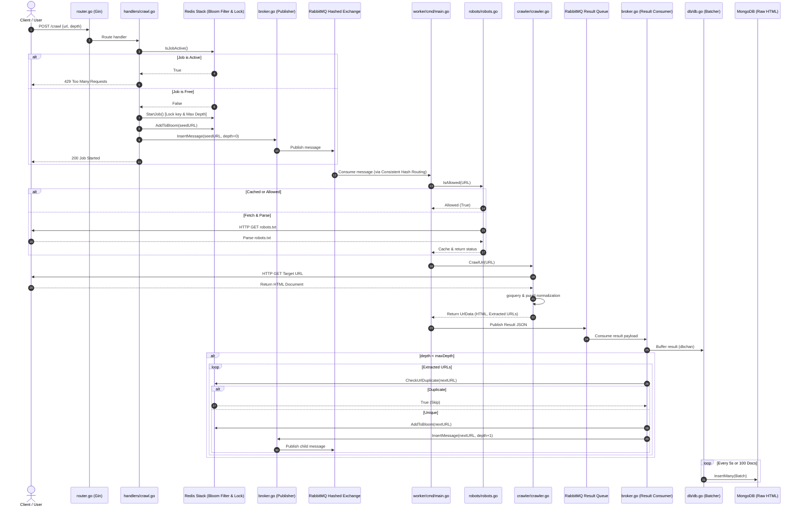
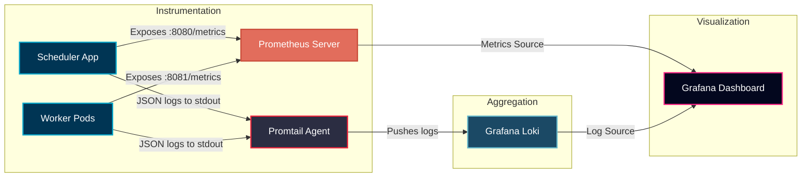

# System Architecture & Component Deep Dive

This document provides a detailed breakdown of the **Distributed Web Crawler** architecture, its components, data flows, queue topology, and key protocols.

---

## 🏗️ System Architecture & Sequence Flow

The crawler employs a master-worker (Scheduler-Worker) architecture to ensure horizontal scalability, fault tolerance, and data ingestion reliability.

### Architectural Diagram


### Crawl Lifecycle Sequence



---

## 🔍 Deep Dive into Components & Code Logic

### 1. Scheduler (The "Brain")
The **Scheduler** coordinates the state of the crawler, monitors timeouts, enforces deduplication, and handles data persistence.
*   **Web Server ([router.go](file:///D:/distributed-crawler/distributed-web-crawler/scheduler/internal/router/router.go))**: Sets up Gin-Gonic routes mapping paths to Gin and promhttp handlers.
*   **Deduplication Engine ([bloom.go](file:///D:/distributed-crawler/distributed-web-crawler/scheduler/internal/bloom/bloom.go))**: Utilizes Redis's `RedisBloom` module (`BF.RESERVE`, `BF.EXISTS`, `BF.ADD`). Standard Redis images lack these commands, necessitating the `redis/redis-stack-server` image.
    *   During startup, it executes `BF.RESERVE url_bloom 0.01 1000000` to establish a Bloom Filter with a 1% false positive probability and a capacity of 1,000,000 items.
    *   `CheckUrlDuplicate` uses `BF.EXISTS` to check if a URL was previously crawled in O(1) time without querying a persistent disk.
*   **Database Ingestion ([db.go](file:///D:/distributed-crawler/distributed-web-crawler/scheduler/internal/db/db.go))**: To optimize MongoDB write I/O, raw HTML files are processed through a concurrent thread-safe buffering pipeline:
    *   `BatchInsert` reads scraped payloads from a Go channel `dbchan`.
    *   If the buffered data reaches `BatchSize (100)`, a background goroutine is spawned to execute `InsertMany` to bulk-insert records into the `crawled_urls` collection.
    *   An independent `time.NewTicker (5s)` guarantees that even during slow crawls, data is flushed to MongoDB.
    *   To conserve storage space, `NextUrls` is set to `nil` before database insertion.
*   **Inactivity Watchdog ([broker.go](file:///D:/distributed-crawler/distributed-web-crawler/scheduler/internal/broker/broker.go))**:
    *   A background daemon runs every 10 seconds.
    *   It passive-checks all queues (`queue_1`, `queue_2`, `queue_3`, and `result_queue`) via `QueueDeclarePassive` to see if their message count is zero.
    *   If all queues are empty, it checks if `time.Now().Unix() - last_activity_time > idleTimeout (300 seconds)`.
    *   If both conditions are met, it triggers `ForceCleanupJob` to release the job lock.

### 2. Worker (The "Muscle")
The **Worker** is stateless and scales horizontally. It pulls URLs from RabbitMQ queues, scrapes HTML documents, extracts links, and reports back.
*   **Task Consumption ([broker.go](file:///D:/distributed-crawler/distributed-web-crawler/worker/internal/broker/broker.go))**:
    *   Workers consume from queues with manual acknowledgements (`autoAck: false`) to implement backpressure.
    *   `ch.Qos(1, 0, false)` configures the channel prefetch count, limiting the worker to fetching a maximum of 1 unacknowledged message at a time per channel.
    *   For each queue consumed, 5 concurrent worker goroutines are spawned, each running on its own dedicated thread-safe `amqp.Channel`.
    *   Once processing completes, `d.Ack(false)` is invoked to remove the message from the queue.
*   **Scraping and Link Normalization ([crawler.go](file:///D:/distributed-crawler/distributed-web-crawler/worker/internal/crawler/crawler.go))**:
    *   Exposes a customized `http.Client` optimized for connection reuse and performance:
        ```go
        transport := &http.Transport{
            MaxIdleConns:        1000,
            MaxIdleConnsPerHost: 100,
            MaxConnsPerHost:     100,
            IdleConnTimeout:     90 * time.Second,
        }
        ```
    *   Parses the HTML response using `goquery` and extracts all links.
    *   Extracted paths are resolved into absolute URLs relative to the parent URL and normalized using the `purell` library. Normalization rules include:
        *   Removing browser fragments (`#`).
        *   Alphabetically sorting query string parameters.
        *   Removing duplicate slashes (`//`).
*   **Robots.txt Compliance ([robots.go](file:///D:/distributed-crawler/distributed-web-crawler/worker/internal/robots/robots.go))**:
    *   Before fetching a URL, the worker checks compliance against the host's `robots.txt` rules using `temoto/robotstxt`.
    *   To avoid overloading target servers, parsed rules are cached in a thread-safe map (`map[string]*robotstxt.Group` protected by a `sync.RWMutex`).
    *   If a request to a host is disallowed, the worker logs the exception and updates the database record with `HasRobots: true` without downloading the page body.
*   **IP-isolated Politeness Rate-Limiting ([politeness.go](file:///D:/distributed-crawler/distributed-web-crawler/worker/internal/crawler/politeness.go))**:
    *   Enforces rate-limits independently inside each worker container using an in-memory lock-free reservation manager.
    *   This ensures each worker node's rotating IP respects crawl delays per domain without throttling other worker nodes operating on different egress IPs.
    *   A background cleaner sweeps inactive domains from the memory cache every 1 minute to prevent memory growth.

### 3. Common Package (Shared Layer)
*   **Unified Connection Manager ([common.go](file:///D:/distributed-crawler/distributed-web-crawler/common/common.go))**: Centralizes configuration, initialization, connection pooling, health checks, and a background self-healing connection monitor that automatically reconnects RabbitMQ and restores broker topology if connection drops.
*   **Viper Configuration ([config.go](file:///D:/distributed-crawler/distributed-web-crawler/common/config.go))**: Loads environment variables with defaults. It recursively searches parent directories to locate a `.env` file, enabling the application to find configuration files regardless of the directory from which it is executed.

### 4. Stateful Infrastructure Layer (Databases & Broker)
The state and messaging layer of the crawler is composed of MongoDB, Redis, and RabbitMQ.
*   **Helm-Driven Deployment**: Rather than maintaining custom manifests, these services are deployed via industry-standard Helm charts:
    *   **MongoDB**: Deployed using the Bitnami Helm chart configured via [mongodb-values.yaml](file:///D:/distributed-crawler/distributed-web-crawler/k8s/values/mongodb-values.yaml).
    *   **RabbitMQ**: Deployed using the RabbitMQ Helm chart configured via [rabbitmq-values.yaml](file:///D:/distributed-crawler/distributed-web-crawler/k8s/values/rabbitmq-values.yaml), which handles plugin setups at startup.
    *   **Redis**: Deployed using the `redis-stack` Helm chart configured via [redis-values.yaml](file:///D:/distributed-crawler/distributed-web-crawler/k8s/values/redis-values.yaml) to run `redis-stack-server` with `RedisBloom` modules.
*   **Standalone Mode (Development)**: In the local deployment and dev configurations, these services are configured as standalone, single-instance pods to save memory and CPU resources.
*   **Seamless Scaling (Production)**: Thanks to packaging the stateful components inside Helm charts, they can be scaled to production grade with simple configuration overrides:
    *   **MongoDB**: Transition from standalone to a multi-replica set configuration with write concern adjustments.
    *   **RabbitMQ**: Scale up to a multi-node cluster by adjusting the chart's node replica counts and enabling queue mirroring.
    *   **Redis**: Migrate to high-availability configurations like Redis Sentinel or a Redis Cluster.
    No application code modifications are required in the Scheduler or Worker modules to adopt these cluster schemas; they simply require pointing to the updated cluster connection strings.

---

## 🔀 Queue Topology & Consistent Hashing

Standard load balancing (like round-robin) distributes URLs across workers arbitrarily. To distribute the crawl load evenly and deterministically, we configure RabbitMQ with the **Consistent Hashing Exchange** plugin (`x-consistent-hash`):

1.  The Scheduler declares a consistent hashing exchange named `consistent_hashing`.
2.  Three queues (`queue_1`, `queue_2`, `queue_3`) are bound to this exchange with a weight routing key of `"1"`.
3.  When publishing, the Scheduler sets the target **full URL string** (e.g., `https://example.com/page-1`) as the routing key.
4.  RabbitMQ hashes the routing key and routes the message to the corresponding queue.
5.  Since the entire URL string (including the path) is used as the routing key, different URLs on the same domain may hash to different queues and be processed by different workers. This distributes the crawl load across all workers even when crawling a single domain. This ensures that new websites and links are explored in parallel across multiple workers, but comes at the cost of cache locality (e.g., `robots.txt` cache hits and DNS lookups are not domain-isolated to a single worker).

---

## 🛑 The Graceful Stop Protocol

If a user starts a crawl at depth 10 on a large site, millions of URLs can flood the queues. The crawler provides a stop mechanism to halt a running job immediately:

1.  The user sends an HTTP request: `POST http://localhost:8080/stop`.
2.  `handlers/stop.go` executes `db.ForceCleanupJob(rdb)`. This deletes the active job key (`crawler:active_job`) and the max depth key (`crawler:max_depth`) from Redis.
3.  The handler calls `broker.PurgeQueues(ch)`.
4.  The system calls RabbitMQ's `QueuePurge` on `queue_1`, `queue_2`, `queue_3`, and `result_queue`.
5.  This empties the queues. Workers currently processing pages finish their active tasks, but subsequent tasks are discarded as the queues are now empty.
6.  The Scheduler watchdog detects that the queues are empty and terminates the job tracking session.

---

## 🛡️ Politeness Enforcement & Rotating IP Egress Vision

### The Distributed Egress IP Vision
In large-scale web crawling, target websites implement IP-based rate limiting or blocklists to protect themselves from scraping. To overcome this, a production-grade distributed crawler routes worker egress traffic through rotating proxy networks or assigns distinct public IP addresses to each worker container replica.

Because each worker container operates under a separate egress IP:
- Target web servers perceive traffic from different workers as independent clients.
- Global/centralized rate limiting across the entire cluster (e.g., locking the domain via Redis) would unnecessarily throttle throughput.
- Enforcing rate-limiting per worker container matches the IP-isolated reality: multiple workers can fetch from the same host concurrently, while ensuring no single worker (and thus no single egress IP) spams the host.

### Lock-Free Local Reservation Queue
To enforce politeness locally per worker while maintaining high CPU and network thread utilisation, the worker uses an in-memory **lock-free reservation pattern**:
1. When a crawler goroutine wants to fetch a URL, it queries `robots.txt` for the `Crawl-delay` (falling back to a default delay, e.g. 3s).
2. It requests a slot from the local `PolitenessManager` for the URL's host.
3. The `PolitenessManager` locks a local map containing host crawl times.
4. If a delay is needed, it computes the sleep duration, advances the next permitted crawl time in the map, and **immediately releases the lock**.
5. The goroutine sleeps in a non-blocking way using Go channels (`time.After`).
6. Because the lock is released immediately after reservation and before the sleep begins, all 5 worker goroutines can schedule their wait times concurrently without blocking the main consumer thread.

### Memory Leaks Prevention (Background Sweeper)
Since a crawler can encounter millions of unique hostnames over a long period, tracking every hostname in memory would cause a memory leak.
The `PolitenessManager` starts a background sweeper:
- **Interval**: Runs every **1 minute**.
- **Eviction Threshold**: Removes any hostname record that has been inactive (not crawled) for more than **5 minutes**.
This guarantees the memory footprint of the worker remains small, constant, and clean.

---

## 📊 Observability (Metrics & Log Aggregation)

The system features a native observability stack designed to monitor crawl performance, stateful queues, and system health in real-time. It integrates metrics collection with **Prometheus**, log aggregation with **Grafana Loki/Promtail**, and visualization with **Grafana**.



### 1. Real-Time Metrics (Prometheus)
*   **Metrics Instrumentation**: Go application services use the `prometheus/client_golang` library to track runtime performance.
    *   **Scheduler**: Exposes internal HTTP routes (e.g. `/metrics` on port `:8080`).
    *   **Worker**: Runs a lightweight, non-blocking HTTP server in a separate background goroutine on port `:8081` solely for exposing metrics endpoints.
*   **Kubernetes Service Discovery**: In K8s deployments, we register a custom Prometheus Operator `ServiceMonitor` (configured in [service-monitor.yaml](file:///D:/distributed-crawler/distributed-web-crawler/k8s/service-monitor/service-monitor.yaml)). Any Kubernetes Service labeled with `monitor: enabled` is automatically detected and scraped.

### 2. Centralized Logging (Grafana Loki & Promtail)
*   **Structured Application Logs**: Both Scheduler and Worker utilize Go's structured `log/slog` library to output logs in JSON format to standard output. 
*   **Log Ship & Enrichment (Promtail)**: 
    *   **Docker Compose**: Promtail mounts the local Docker daemon socket (`/var/run/docker.sock`) to discover containers. It adds compose metadata labels (such as `service` and `container`).
    *   **Kubernetes**: Promtail runs as a `DaemonSet`, mounting the host node directory `/var/log/pods` to read all container logs, enriching them with Kubernetes API labels (such as `namespace`, `pod`, and `container`).
*   **Loki Ingestion Engine**: Loki acts as a highly optimized, metadata-indexed log database. It is configured to run in `Monolithic` mode with persistent volume storage for local deployments, accepting pushed logs from Promtail on port `3100`.
*   **Dynamic Log Parsing (LogQL)**: Because application logs are natively structured as JSON, queries in Grafana can dynamically extract properties at query time. For example:
    ```logql
    {service="scheduler"} | json | level="ERROR"
    ```
    This extracts the JSON fields (`time`, `level`, `msg`, `url`, etc.) as filterable labels on-the-fly.
